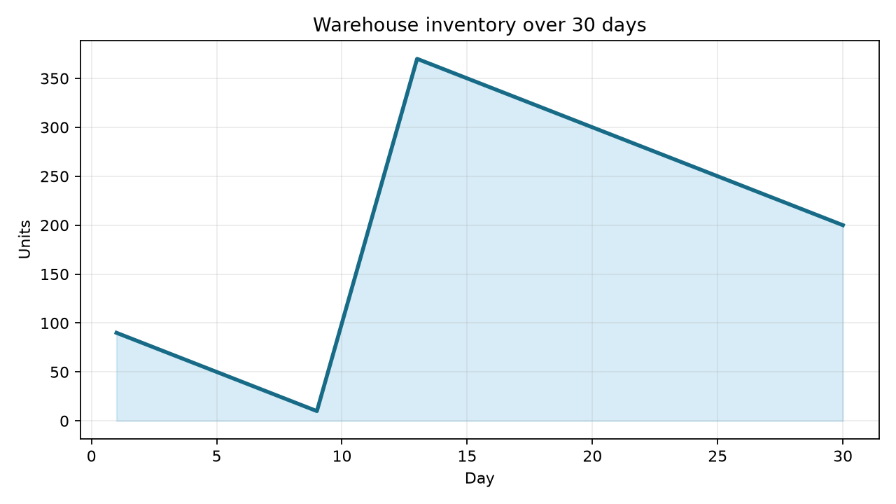

# supplychain-abm

[](https://github.com/Karthikkamsala/SC-ABM/actions/workflows/ci.yml)

> A virtual laboratory for experimenting with supply-chain decisions, disruptions, and policies.

**supplychain-abm** is an open-source Python framework for agent-based simulation of supply chains. Built on [Mesa](https://mesa.readthedocs.io/) and [NetworkX](https://networkx.org/), it lets you create virtual supply chains with autonomous agents, run simulations, and measure performance.

## Features

- **Agent types**: Supplier, Factory, Warehouse, Retailer, Customer
- **Inventory management** with stockout tracking
- **Order lifecycle** (Created → Accepted → Shipped → Delivered)
- **Configurable lead times** and shipment tracking
- **Demand generators**: Constant, Random, Seasonal
- **Inventory policies**: Reorder Point (extensible)
- **Supply-chain network** via NetworkX directed graph
- **Metrics**: inventory levels, service level, stockouts, orders, costs
- **Visualization**: inventory, demand, orders, service level, bullwhip plots
- **Reproducible** simulations via random seeds

## Installation

The project is currently installed directly from GitHub:

```bash
pip install git+https://github.com/Karthikkamsala/SC-ABM.git
```

For development:

```bash
git clone https://github.com/Karthikkamsala/SC-ABM.git
cd SC-ABM
pip install -e ".[dev]"
```

The package is not currently published on PyPI.

## Quick Start

```python
from supplychain_abm import SupplyChainModel

# Create the simulation model
model = SupplyChainModel(seed=42)

# Add agents
supplier = model.add_supplier(name="Supplier", inventory=1000)
warehouse = model.add_warehouse(
    name="Warehouse",
    inventory=100,
    reorder_point=50,
    order_quantity=100,
)
customer = model.add_customer(name="Customer", demand=10)

# Connect the supply chain
model.connect(supplier, warehouse, lead_time=3)
model.connect(warehouse, customer, lead_time=1)

# Run for 30 days
model.run(steps=30)

# View results
results = model.results()
print(results)
```

The basic example prints a reproducible summary like this:

```text
total_demand: 300.00
total_fulfilled: 300.00
overall_service_level: 1.00
total_stockouts: 0.00
avg_inventory: 445.83
```

It also plots warehouse inventory over time with `model.plot_inventory()`. Run
the complete example with:

```bash
MPLBACKEND=Agg python examples/basic_supply_chain.py
```



## Core Concepts

| Concept | Description |
|---------|-------------|
| **Agents** | Autonomous supply-chain entities that observe, decide, and act |
| **Network** | Directed graph connecting agents (edges carry lead time) |
| **Inventory** | Stock levels tracked per agent with stockout recording |
| **Orders** | Requests from downstream to upstream agents |
| **Shipments** | Physical goods in transit with lead-time-based arrival |
| **Demand** | Pluggable demand generators (constant, random, seasonal) |
| **Policies** | Decision rules for ordering (reorder point, extensible) |
| **Metrics** | Per-step data collection for analysis and visualization |

## Examples

See the `examples/` directory for complete runnable scripts:

- `basic_supply_chain.py` — Supplier → Warehouse → Customer
- `supplier_disruption.py` — Supplier goes offline for 10 days
- `demand_increase.py` — Demand jumps mid-simulation
- `inventory_policy.py` — Compare different reorder points
- `bullwhip_effect.py` — Order variance amplification

## Running Tests

```bash
pytest tests/ -v
```

The test suite runs automatically on every push and pull request for Python
3.10 through 3.13.

## License

MIT License — see [LICENSE](LICENSE) for details.

## Acknowledgements

Built with:
- [Mesa](https://mesa.readthedocs.io/) (Apache 2.0) — agent-based modelling framework
- [NetworkX](https://networkx.org/) (BSD) — graph/network library
- [NumPy](https://numpy.org/) (BSD) — numerical computing
- [Pandas](https://pandas.pydata.org/) (BSD) — data analysis
- [Matplotlib](https://matplotlib.org/) (PSF-like) — visualization
